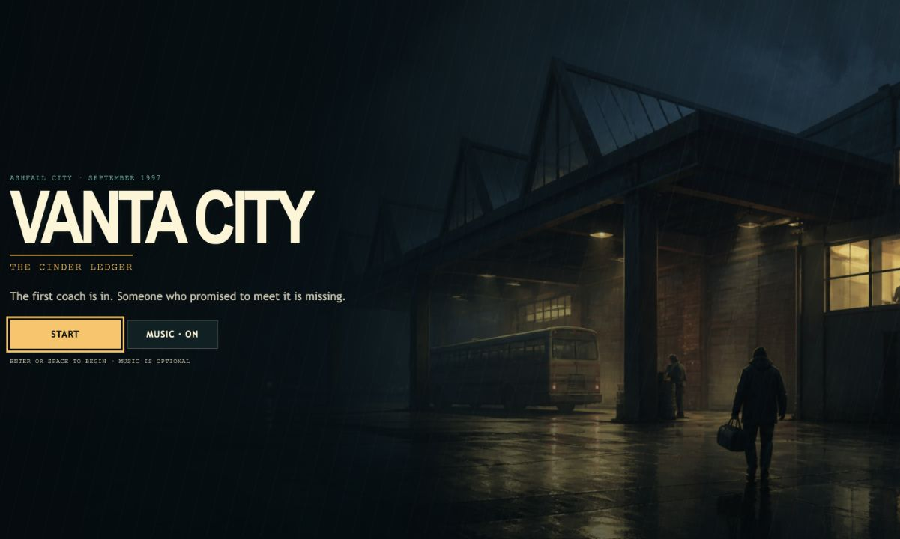
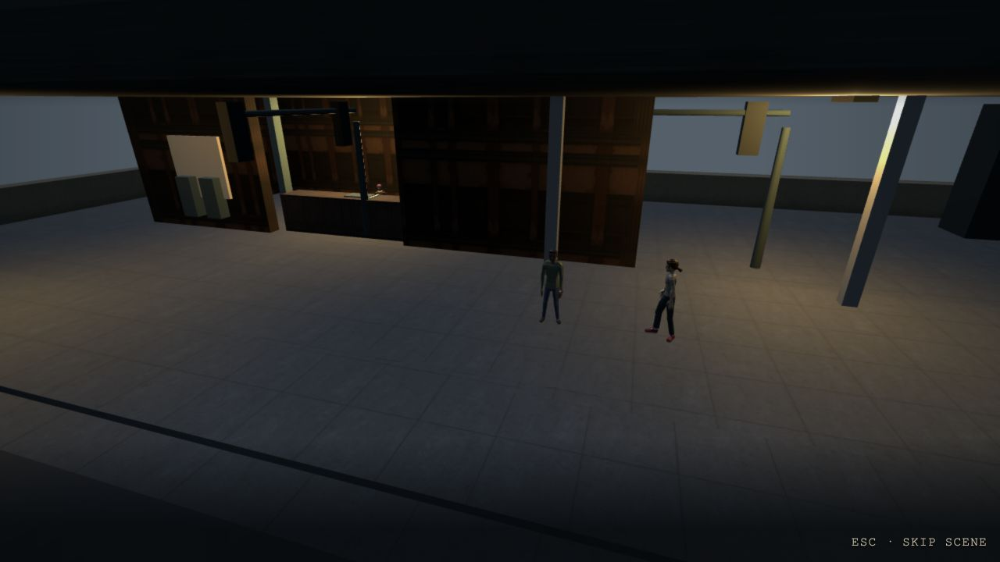
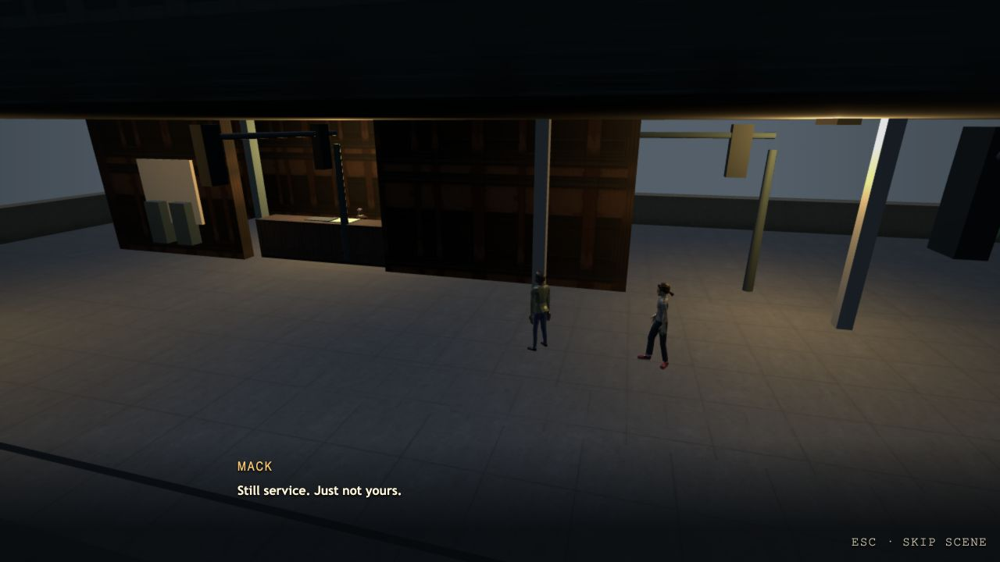
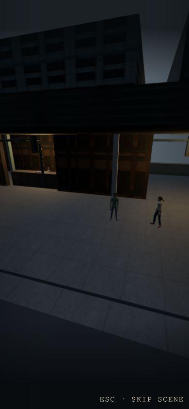
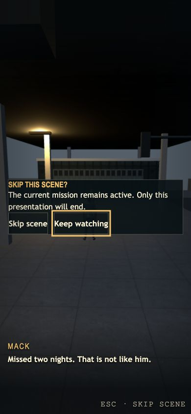

# MISSION-003A baseline visual review

Review date: 2026-07-19.

Review target: the current local opening cinematic and shared cinematic UI at
base commit `78ff0b83069a406ffb6669238c224977a8e9b6d0`.

Purpose: establish composition, subtitle, and skip-confirmation constraints for
the unimplemented Carbon Copy mission and cinematic. These images are baseline
evidence, not a claim that `cinematic.ash-002-copy-choice` exists.

## Reviewed captures

### Desktop title and opening

At 1280×720, subtitle contrast and the lower presentation reserve are readable.
The current three-person establishing composition leaves substantial empty
space and makes the actors read mostly as silhouettes. Carbon Copy therefore
uses one short, closer establishing shot followed by medium two-shots and paper
inserts. It does not rely on distant facial acting.

The early and middle frames also show that neutral character holds change very
little over time. Carbon Copy puts narrative motion in level-owned register,
carbon, cash, envelope, and receipt paths while keeping actor claims exact.

### Narrow opening and skip confirmation

At 390×844, reusing a landscape three-body wide makes the characters too small
to carry the beat. Carbon Copy requires responsive-safe anchors, a stacked
foreground/background establishing composition, and central medium shots. The
register insert must isolate only the two essential paper shapes.

The current confirmation modal fits the narrow viewport, exposes an accessible
dialog role, and puts initial focus on the keep-watching action. The buttons are
compact, so the implementing UI review must include 125% text. Its current copy
says the mission remains active; Carbon Copy is requested after mission
completion, so the existing component needs a contextual copy review while
retaining the same modal, focus, input, and cleanup ownership.

## Direction decisions from the review

| Finding                                                | Carbon Copy response                                                                                          |
| ------------------------------------------------------ | ------------------------------------------------------------------------------------------------------------- |
| Distant three-way view weakens actor readability       | Limit the wide to 4.2 seconds and require 12% subject margins; use safe alternate anchors on narrow/ultrawide |
| Neutral holds barely change across committed frames    | Carry the action with six explicit level-owned prop paths; never substitute applause or random acting         |
| Medium Della framing and document inserts are readable | Favor restrained medium Della/Rook shots and a dedicated register/carbon insert; do not use extreme close-ups |
| Narrow landscape composition shrinks all participants  | Stack the witness triangle, keep critical heads above screen Y 0.66, and keep action in the central 76%       |
| Existing subtitles remain readable in their reserve    | Preserve the current subtitle owner and use non-overlapping cues under 17 characters/second                   |
| Existing skip modal and focus behavior are usable      | Reuse the component and pause/resume generation contract; review completed-mission copy and 125% wrapping     |

## Console and network findings

The in-app browser inspection covered title, early/middle/late committed
cinematic frames, responsive narrow composition, and skip confirmation.

- Runtime exceptions: 0
- Console errors: 0
- Console warnings: 0
- Application GET failures: 0
- Observed application requests: 135
- Cancelled requests: 8 local optional-asset `HEAD` availability probes for
  portrait/model/pickup candidates; each ended `net::ERR_ABORTED` and none was a
  failed application GET
- Unexpected application external HTTP(S) requests: 0

The browser tooling also loaded its own extension image; it is not an
application network dependency. The CDP event buffer reported older events
evicted before the final cursor, while the reviewed action period returned all
143 captured events with no further page. Implementing work must still produce
fresh Playwright console/network evidence for the new scene.

Machine-readable findings are in `baseline-diagnostics.json`.

## Baseline limitations

- Carbon Copy, the WORLD-004 night venue, the five evidence visuals, responsive
  anchors, and venue NPC placements are not implemented at this base.
- This review cannot validate Carbon Copy staging, occlusion, exact restoration,
  reduced motion, performance preflight, path cleanup, or reward/fact ordering.
- Baseline captures are PNG stills. Existing cinematic-005 WebM and committed
  early/middle/late captures were inspected for temporal direction, but this
  artifact set does not duplicate those repository-owned files.
- The eight cancelled optional-asset probes are current baseline behavior, not
  an acceptance waiver for future required Carbon Copy assets.
