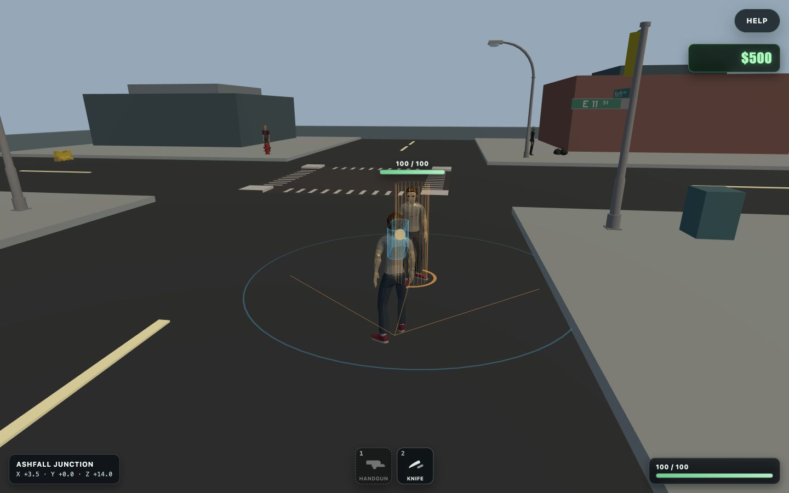
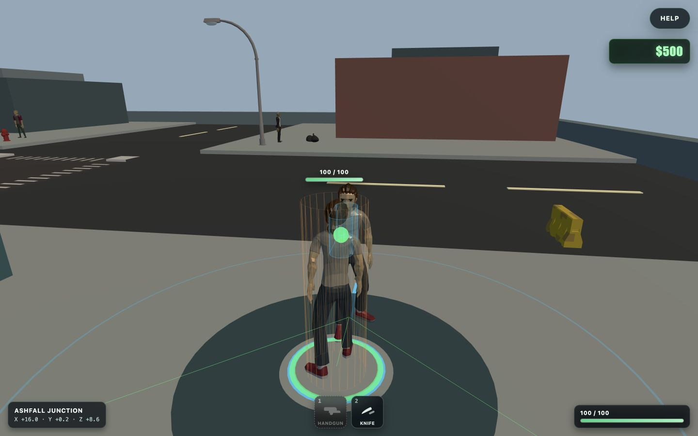
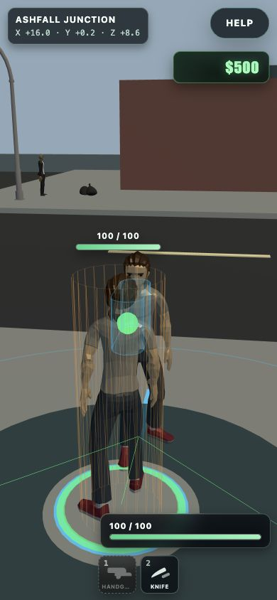
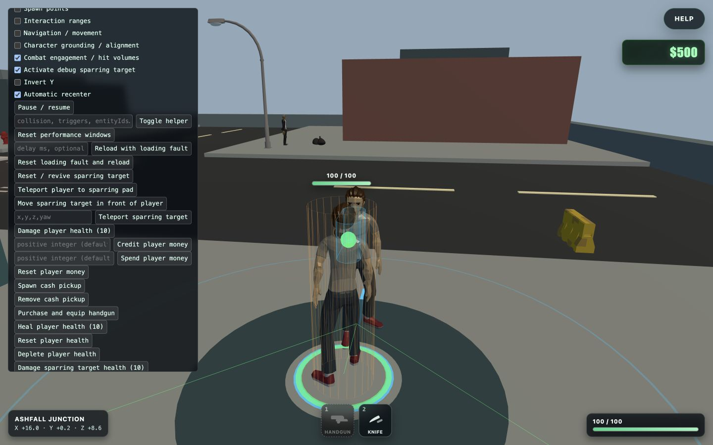

# Debug sparring target

Ashfall Junction declares a development spawn for one stationary sparring target, but normal startup creates no target object, collision, listener, visual, or health bar. Launch a Vite development build with `?sparringFixture=1` to activate it at `spawn.debug-sparring-target`; production ignores this parameter. The URL state is reflected by **Activate debug sparring target** in `Commands / Actions`, and the same toggle can create the fixture from an absent state without the URL. **Reset / revive sparring target** activates it if needed, restores full health, clears response and ignored-event counters, and returns its presentation to idle.

The authored pad is on the open northeast sidewalk apron at `(16, 0.2, 9.5)`, south of the northeast ruin, east of the signal controller, and clear of the east-road barrier and NPC fixtures. The combat-ready player spawn approaches from the south so the gameplay camera looks across the open intersection edge instead of through ruin collision. **Teleport player to sparring pad** uses that grounded spawn. **Move sparring target in front of player** supports testing elsewhere, and the coordinate command remains available for exact vertical/range cases.

`CharacterActionTarget` is the gameplay-facing response contract. `SparringTargetSystem` listens only to `PlayerControllerSystem`'s animation-timed `character-action:impact` event and delegates an accepted response to the target. It does not inspect keyboard input or register a listener. Disabled, game-state-owned, target-busy, out-of-range, vertically separated, and not-facing impacts are counted with explicit reasons.

Contact uses one game-owned attack/hurt-volume contract at the impact marker. The values are based on both playable models' authored poses: punch wrists reach `0.41–0.44m` and kick feet reach `0.92–0.98m`. A punch sweeps from `0.18m` to `0.56m` in front of the simulation origin with `0.12m` radius and a `1.15–1.55m` vertical band. A kick sweeps from `0.28m` to `1.00m` with `0.14m` radius and a `0.45–0.95m` band. Both test against the target's `0.30m` radius, `1.8m` high hurt cylinder and require facing dot `0.65`. Thus maximum straight-line center contact is `0.98m` for a punch and `1.44m` for a kick; the authored player spawn is a punch-ready `0.9m` away. The snapshot exposes sweep endpoints, closest contact, signed horizontal gap, vertical overlap, facing, state, health, collision/listener lifecycle, and the latest accepted/rejected decision.

Player one-shots hold an action lock from acceptance until the active Three.js mixer action emits `finished`. A duration-plus-`0.1s` fallback prevents a malformed mixer lifecycle from stranding the lock. Busy requests are rejected, never queued, and do not advance left/right alternation. Completion restores locomotion in the release frame and publishes exactly one completion sequence.

Punches publish one impact at normalized animation time `0.55`; kicks publish one at `0.62`. This occurs while the player action remains busy and before its completion event. A confirmed punch applies `8` debug damage and a kick applies `12`; misses, busy targets, duplicate inputs, and gated actions apply none. The target reaction runs through the same small animation graph, then returns to idle on its mixer completion with a duration fallback. The standard **Combat engagement / hit volumes** helper draws the `3.0m` engagement boundary, exact extruded action sweep, facing cone, target hurt cylinder, impact/contact marker, and player-to-target line: green means eligible, orange means blocked, yellow flashes for accepted impact, and red flashes for ignored impact. The browser/debug snapshot exposes the same math and feedback without adding listeners.

The target uses the local Ultimate Modular Men `casual-character.glb` model and its native `CharacterArmature|Idle` (`1.666667s`) and primary `CharacterArmature|HitRecieve` (`0.541667s`) clips. The alternate `HitRecieve_2` is intentionally not selected. The reaction now runs on the skeleton that owns it instead of filtering cross-rig tracks onto an Animated Men model. `CharacterLoader` strips scene-root motion, the entity restores its loaded model-root position after every mixer update, and bounds-derived visual alignment keeps the fixed simulation origin grounded.

Enabling from anywhere does not imply camera engagement. An accepted punch/kick start requests focus only when the target is within `3.0m`, facing dot `0.2`, vertical proximity, active gameplay, and no owning pause/help/dialogue/cinematic/picker state. The request caps gameplay distance at `4.25m` only for that one-shot and releases on completion or as soon as engagement becomes invalid. The camera remains in gameplay ownership and alone applies smoothing, reduced-motion behavior, shoulder offset, obstruction safety, yaw, and pitch. The user's configured distance is never overwritten; releasing the request restores that exact preference and relationship, subject to the same collision shortening that applied before focus.

`HealthComponent` is a reusable game-owned current/maximum contract with clamped damage, heal, set, reset, normalized/alive state, and typed changed/depleted/restored events. The player and debug target own separate components. Depletion plays the target's native death state; reset/revive restores its idle state. The gameplay HUD observes player health, while a projected target bar appears only for this explicitly health-bearing target and hides when it is deactivated, removed, off-screen, or world-occluded; ordinary conversation NPCs do not show health.

Activation adds one player-blocking target body and marks it camera-pass-through so combat framing and the target health projection cannot self-occlude. Deactivation releases combat focus, unsubscribes all three player-action listeners, removes the collision, target and diagnostic visuals, hides the target health UI, disposes health/animation resources, and clears fixture debug state. Repeated activation is coalesced so exactly one target can exist. The target has no Talk registration and never enters the normal `NpcSystem` roster. There is no retaliation, navigation, dialogue, mission state, weapon, police, traffic, persistence, or AI behavior.

## Ashfall placement and controls

Before, the target and engagement visualization occupied the north traffic lane:

The redesigned pad is fully on the northeast sidewalk and remains legible at desktop and narrow widths:

The debug actions keep activation, visualization, teleport, and revive controls together:

